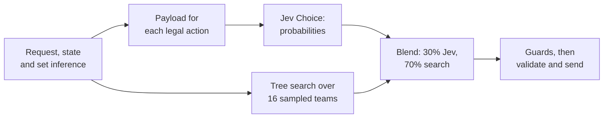

# JevMon

A Pokémon Showdown bot for **Gen 9 Random Battle**. Each turn it asks [TypeSafe's Jev](https://docs.typesafe.ai)
to weigh the legal moves, runs a Monte Carlo tree search over possible opposing teams, blends the two, and lets code
veto the few moves that are provably self-defeating. Strict TypeScript, with a vendored Rust search engine.

## Results

Playing as [TheNameIsJev](https://pokemonshowdown.com/users/thenameisjev) on the public ladder, 23–25 September 2026:

| | |
|---|---|
| Rated games | 274: 165 wins, 108 losses, 1 unfinished |
| Rating | 1,000 → **2,210 Elo** at its peak, **#168** on the Gen 9 Random Battle ladder |
| GXE | 83.5% |
| Jev calls | 7,056, of which 45 (0.6%) failed and fell back to a legal move |
| Tests | 421 |

`node scripts/ladder-report.mjs` rebuilds the record from the battle logs.

## How a turn is decided



1. **Legal actions** come only from Showdown's private request, never from the bot's own reading of the battle.
2. **State and inference.** A tracker follows everything public: HP, status, boosts, revealed moves, items, Tera,
   hazards, weather. Each opposing Pokémon's possible sets come from
   [pkmn/randbats](https://github.com/pkmn/randbats) data (600,000 generated teams), with a probability for each,
   and are narrowed as the battle reveals turn order and damage.
3. **Payload.** Every legal action gets a comparable evaluation: damage range and knockout chance across the
   possible sets, who moves first, what we take if we stay in, each switch-in's matchup, what a status, boost or Tera
   actually buys, and which of our Pokémon beat which of theirs. Jev's
   [Choice primitive](https://docs.typesafe.ai/primitives/choice) returns a probability for every action, and the
   response is checked before use.
4. **Search.** [poke-engine](https://github.com/pmariglia/poke-engine), the MIT-licensed Rust engine behind Foul
   Play, runs Monte Carlo tree search on 16 sampled versions of the opposing team, 200 ms each, in parallel. It is
   vendored at a pinned commit with local fixes (see [Test results](docs/TEST-RESULTS.md)).
5. **Blend.** The search gets 70% of the weight and Jev 30%. When the search's lead is small in both score and
   visits, Jev's choice stands. A Tera is played only if the search gives it more visits than the plain move.
6. **Guards.** Deterministic checks in `src/strategy/` skip moves that cannot work or undo themselves: a
   Substitute into the hit that just broke the last one, a status move into a type immune to it, setup into a faster
   knockout. A skipped move falls to the next-ranked action, or to one the guard names, so the model still decides.
7. **Validate and send.** The choice is checked against the latest request just before sending. If Jev fails or
   times out, the search's ranking decides, and failing that a random legal move.

## What the logs showed about the model

Every decision is logged with the exact payload, Jev's probabilities, the search's visit shares and any guard that
fired, and each change was made after replaying those logs against what actually happened. The details are in
[AUDIT-2026-09-23](docs/AUDIT-2026-09-23.md), [AUDIT-2026-09-24](docs/AUDIT-2026-09-24.md) and
[Test results](docs/TEST-RESULTS.md).

- **The right number was usually already there.** In ten traced misplays, the payload already held the figure that
  should have changed the choice. One Garganacl used Protect five turns in a row with a 3.7% success chance printed
  beside it. More text made it worse: two extra instruction paragraphs (about 1.4 KB) raised the share of decisions
  sent at the lowest detail level from 11% to 31%. Narrow guards fixed what extra fields did not.
- **The model treats its inputs as fact.** Sleep wake-up odds that were off by one turn, a 50% Defense boost shown
  as certain, and instructions describing a field that was never sent all led straight to misplays. A paragraph about a
  situational field is now sent only when that field is in the payload.
- **Its preferences are soft, and they lean.** The median top probability was about 2.45 times uniform. Jev rarely
  set up (6 setup picks where the search had 30) and spent Tera early (median turn 9, against turn 16 for opponents).
  A 0.03 "noise" margin handed close calls to Jev; rerunning 40 of them, the search kept its own choice 108 times out
  of 120, so the margin was not noise and the rule changed.
- **Showing the search to Jev counted it twice.** With the search's verdict in the payload and blended in afterwards,
  Jev stopped being an independent opinion. Blend mode now leaves it out by default, and each decision records
  `search.inPayload` so games with and without it can be compared.
- **Predictions need calibrating too.** A "certain" knockout on our active Pokémon, facing a revealed move, came true
  129 times in 159. On a Pokémon switching in, it was 23 in 50. Guards that act on a prediction are replayed over the
  logs before they ship.

## Tools for looking at decisions

- **Live view** at <http://127.0.0.1:8733> while the bot runs, or `npm run view` from the logs: the arena, a
  play-by-play, and for each decision Jev's probability beside the search's share for every option, plus any guard
  that overruled them. It also has a performance page with the rating over time, and replays of any recorded battle
  with a full-screen Present mode for recording.
- **`node scripts/inspect-battle.mjs logs/<file>.jsonl turn <n>`** rebuilds exactly what Jev was sent on any turn.
- **`npm run preflight`** replays recent decisions through new code before a restart: payload sizes, detail levels,
  and which guards would now change a logged choice.
- **`node scripts/audit-decisions.mjs`** and **`audit-outcomes.mjs`** replay every logged decision and check guard
  predictions against what happened next.
- **`npm run bench`** plays two search configurations against each other on a local simulator, each seed twice with
  the teams swapped, and reports a win rate with a 95% interval. 200 games resolve about 70 Elo.

## Repository map

| Path | What it holds |
|---|---|
| `src/showdown/` | WebSocket connection, login, challenges, protocol parsing |
| `src/battle/` | State tracker, legal actions, battle manager and the decision loop |
| `src/decisions/` | Jev provider (payload, validation, instructions) and the random provider |
| `src/pokemon/`, `src/strategy/` | Mechanics, set inference, damage, and the per-action evaluation and guards |
| `src/search/` | Conversion to poke-engine's format and the sampled-world search |
| `src/ui/` | Live view, replays and performance page |
| `src/logging/`, `src/config/` | JSONL battle logs and validated settings |
| `test/` | 421 tests: requests, state, mechanics, payload shape, guards, search, UI |
| `vendor/poke-engine/` | The Rust search engine, pinned, with local fixes |
| `extension/` | Chrome side panel that shows the live view beside a Showdown battle |
| `scripts/` | Ladder report, audits, preflight, self-play bench, data refresh, deploy |
| `docs/` | [Running](docs/RUNNING.md), [design notes](docs/DESIGN.md), [Jev API contract](docs/JEV.md), [test results](docs/TEST-RESULTS.md), audits |

## Quick start

```sh
npm install
cp -n .env.example .env
npm test
npm run build:engine   # the search needs Rust: brew install rust
```

In `.env`, set a Showdown account made for the bot, a TypeSafe API key and:

```dotenv
BATTLE_MODE=jev
DRY_RUN=false
PLAY_MODE=ladder
LADDER_BATTLES=10
SEARCH_MODE=blend
SEARCH_WEIGHT=0.7
SEARCH_MS_PER_WORLD=200
```

Then `npm run build && npm start`, and open <http://127.0.0.1:8733>. Every call to Jev is a paid request.
[docs/RUNNING.md](docs/RUNNING.md) covers the other modes (observe, dry run, challenges), spending caps, running it
on a server, and the safety limits on credentials and the live view.

## Credits

- [poke-engine](https://github.com/pmariglia/poke-engine) by pmariglia (MIT), vendored in `vendor/poke-engine`.
- [pkmn/randbats](https://github.com/pkmn/randbats) for random battle set data, and
  [`@pkmn/dex`](https://github.com/pkmn/ps) and [`@smogon/calc`](https://github.com/smogon/damage-calc) for game data
  and damage.
- The [Pokémon Showdown](https://github.com/smogon/pokemon-showdown) protocol documentation.

MIT licensed.
